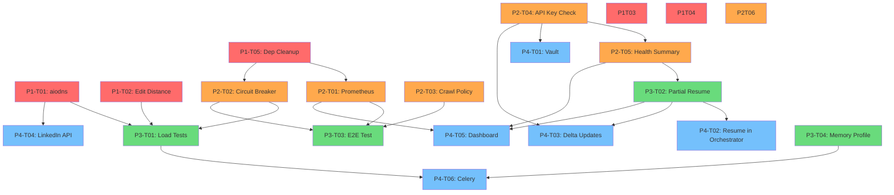

# NAM Intelligence Pipeline — Work Breakdown Structure

> **Created:** 2026-02-07
> **Based on:** `docs/PRODUCTION_READINESS_ASSESSMENT.md` §7 Recommended Roadmap
> **Designed for:** 3–5 parallel developers with zero same-file merge conflicts per phase

---

## Table of Contents

1. [Assessment Reconciliation](#1-assessment-reconciliation)
2. [Conflict Avoidance Matrix](#2-conflict-avoidance-matrix)
3. [Phase 1: Critical Fixes & Hardening (Weeks 1–2)](#3-phase-1-critical-fixes--hardening-weeks-12)
4. [Phase 2: Observability & Resilience (Weeks 3–4)](#4-phase-2-observability--resilience-weeks-34)
5. [Phase 3: Performance & Testing (Weeks 5–6)](#5-phase-3-performance--testing-weeks-56)
6. [Phase 4: Advanced Features (Weeks 7+)](#6-phase-4-advanced-features-weeks-7)
7. [Developer Assignment Guide](#7-developer-assignment-guide)

---

## 1. Assessment Reconciliation

The assessment (§6) identified 8 critical issues. **Code verification against the current codebase** reveals that several P0 issues have already been resolved. The WBS below reflects the **actual current state**, not the assessment's original descriptions.

### Already Fixed (No WBS Task Needed)

| Assessment Issue | Status | Evidence |
|-----------------|--------|----------|
| **#2** Entity resolver triple-index bug | ✅ Fixed | `entity_resolver.py:209-217` — single clean `record_map` dict built by iterating all three index dicts with dedup via `if str_id in record_map: continue` |
| **#3** Silent `except Exception: pass` | ✅ Fixed | All 9+ exception handlers in `firmographic.py` (lines 160, 195, 260), `tech_stack.py` (lines 191, 217, 302), and `crossref.py` (line 165) now have structured `self.log.warning()`/`self.log.debug()` logging |
| **#4** Timestamp uses `asyncio.get_event_loop().time()` | ✅ Fixed | `crossref.py:117` — now uses `datetime.now(UTC).isoformat()` |

### Partially Fixed (Reduced Scope)

| Assessment Issue | Status | Remaining Work |
|-----------------|--------|----------------|
| **#1** Synchronous DNS in async path | ⚠️ Partial | `crossref.py:158,163` wrapped in `asyncio.to_thread()`, but socket fallback at line 177 (`socket.gethostbyname`) is still synchronous. Full `aiodns` not yet adopted. |

### Still Open (Full WBS Tasks Required)

| Assessment Issue | Status | File(s) |
|-----------------|--------|---------|
| **#5** Enrichment agents bypass crawler-only policy | ❌ Open | `tech_stack.py:205`, `firmographic.py:252` make direct HTTP; not in `CRAWLER_AGENTS` set (`policy.py:105`) |
| **#6** Jaccard character-set similarity fallback | ❌ Open | `dedupe.py:208-216` — `_basic_similarity()` uses set intersection, not edit distance |
| **#7** Indeed.com direct scraping (fragile, ToS risk) | ❌ Open | `tech_stack.py:289-310` — `_detect_job_postings()` scrapes Indeed HTML |
| **#8** LinkedIn URL heuristic | ❌ Open | `crossref.py:241-262` — `domain.replace('.', '-')` slug construction |

### New Issues Identified During Verification

| Issue | File(s) | Priority |
|-------|---------|----------|
| No circuit breaker pattern in `AsyncHTTPClient` | `skills/common/SKILL.py:179-248` | P1 |
| Prometheus metrics imported but not wired | `requirements.txt:56` (prometheus-client), no instrumentation code | P1 |
| No API key health checks at startup | `agents/base.py`, `agents/orchestrator.py` | P2 |
| Dependency redundancies: `aiohttp`+`httpx`, `ratelimit`+`tenacity`+custom, `psycopg2-binary`+`asyncpg` | `requirements.txt` | P2 |
| Ruff config missing `B` (bugbear) and `S` (bandit) selectors | `pyproject.toml:12` | P1 |
| No operational runbook | `docs/` | P2 |

---

## 2. Conflict Avoidance Matrix

Each cell shows which Phase/Task owns that file. **No two tasks in the same phase share a file.**

| File | Phase 1 | Phase 2 | Phase 3 | Phase 4 |
|------|---------|---------|---------|---------|
| `agents/validation/crossref.py` | P1-T01 | — | — | P4-T04 |
| `agents/validation/dedupe.py` | P1-T02 | — | — | — |
| `agents/enrichment/tech_stack.py` | P1-T03 | — | — | — |
| `pyproject.toml` | P1-T04 | — | — | — |
| `requirements.txt` | P1-T05 | — | — | — |
| `skills/common/SKILL.py` | — | P2-T01, P2-T02 (split by class) | — | — |
| `middleware/policy.py` | — | P2-T03 | — | — |
| `agents/base.py` | — | P2-T04 | P3-T04 (different method) | — |
| `agents/orchestrator.py` | — | P2-T05 | — | P4-T02 |
| `docs/RUNBOOK.md` | — | P2-T06 | — | — |
| `state/machine.py` | — | — | P3-T02 | — |
| `tests/test_pipeline_integration.py` | — | — | P3-T03 | — |
| `agents/enrichment/firmographic.py` | — | — | — | P4-T03 |
| `.github/workflows/ci.yml` | — | — | P3-T01 | — |

> **P2-T01** touches `SKILL.py` class `AsyncHTTPClient` (lines 119-248).
> **P2-T02** touches `SKILL.py` by adding a new `CircuitBreaker` class after line 248. These are split by class boundary — T01 modifies existing methods, T02 adds a new class — but should be sequenced T02→T01 within the sprint to avoid git conflicts, OR assigned to the same developer.

---

## 3. Phase 1: Critical Fixes & Hardening (Weeks 1–2)

**Goal:** Eliminate remaining async violations, strengthen deduplication accuracy, remove fragile scraping, and tighten lint rules.
**Estimated effort:** 15 hours (recalibrated from original 11h — original P0 tasks resolved, replaced with backfill from P1/P2)
**Parallel capacity:** 5 independent tasks, 0 file overlaps

| Task ID | Task Name | File(s) Affected | Effort | Priority | Acceptance Criteria | Depends On |
|---------|-----------|-----------------|--------|----------|-------------------|------------|
| **P1-T01** | Upgrade DNS to `aiodns` + fix sync socket fallback | `agents/validation/crossref.py` (lines 151–188, method `_validate_dns_mx`) | 3h | P0 | 1. `socket.gethostbyname()` at line 177 replaced with `await aiodns.DNSResolver().gethostbyname()` or wrapped in `asyncio.to_thread()` 2. `import dns.resolver` replaced with `aiodns` for native async 3. `test_validation_crossref.py` passes with new async DNS mocks 4. No synchronous blocking calls remain in the method | — |
| **P1-T02** | Replace Jaccard character-set similarity with edit distance | `agents/validation/dedupe.py` (lines 208–216, method `_basic_similarity`) | 3h | P1 | 1. `_basic_similarity()` uses `rapidfuzz.fuzz.ratio()` (already in `requirements.txt:36`) or Levenshtein distance instead of `set(s1) & set(s2)` 2. `"abc"` vs `"cab"` no longer scores 1.0 (current bug: identical character sets → perfect match regardless of order) 3. `_fuzzy_match()` (lines 190–206) fallback path updated if needed 4. `test_validation_dedupe.py` updated with regression cases for anagram detection | — |
| **P1-T03** | Gate Indeed.com scraping behind feature flag | `agents/enrichment/tech_stack.py` (lines 289–351, method `_detect_job_postings`) | 3h | P2 | 1. `_detect_job_postings()` checks config flag before HTTP request 2. Default is `False` (disabled) — returns `None` immediately when disabled 3. Add `enable_indeed_scraping: false` to `config/agents.yaml` under `tech_stack` 4. Add log warning when Indeed scraping is attempted while disabled 5. `test_enrichment_tech_stack.py` covers both enabled and disabled paths | — |
| **P1-T04** | Add Ruff `B` (bugbear) and `S` (bandit) lint selectors | `pyproject.toml` (line 12) | 2h | P1 | 1. `select` includes `"B"` and `"S"` 2. Specific `S`/`B` rules that break existing code added to `ignore` with justification comments 3. `ruff check .` passes with zero new errors 4. CI pipeline unaffected | — |
| **P1-T05** | Clean up dependency redundancies + add `aiodns` | `requirements.txt` | 4h | P2 | 1. Remove `aiohttp` (line 11) — project uses `httpx` exclusively 2. Remove `ratelimit` (line 52) — project uses custom `RateLimiter` 3. Remove `psycopg2-binary` (line 40) — project uses `asyncpg` 4. Add `aiodns>=3.1.0` (supports P1-T01) 5. `pip install -r requirements.txt` succeeds 6. All 28 test files pass 7. `grep -r` confirms no imports of removed packages | — |

### Phase 1 Developer Assignment

```
Developer A → P1-T01 (crossref.py)
Developer B → P1-T02 (dedupe.py)
Developer C → P1-T03 (tech_stack.py)
Developer D → P1-T04 (pyproject.toml)
Developer E → P1-T05 (requirements.txt)
```

**Zero merge conflicts** — each task touches exactly one file, and no file appears twice.

> **P1-T05 → P1-T01 coordination:** P1-T05 adds `aiodns` to `requirements.txt`, which P1-T01 consumes. Since they modify different files, both PRs merge independently. P1-T01 developer can `pip install aiodns` locally during development.

---

## 4. Phase 2: Observability & Resilience (Weeks 3–4)

**Goal:** Wire production monitoring, add failure isolation, enforce crawl policies, and create operational documentation.
**Estimated effort:** 26 hours
**Parallel capacity:** 6 tasks; P2-T01 and P2-T02 touch `SKILL.py` but at different class boundaries (see note below)

| Task ID | Task Name | File(s) Affected | Effort | Priority | Acceptance Criteria | Depends On |
|---------|-----------|-----------------|--------|----------|-------------------|------------|
| **P2-T01** | Wire Prometheus metrics to `AsyncHTTPClient` | `skills/common/SKILL.py` (lines 119–248, class `AsyncHTTPClient`, method `_request`) | 6h | P1 | 1. Add counters: `http_requests_total`, `http_request_duration_seconds`, `http_errors_total` (labeled by domain, method, status) 2. Import `prometheus_client` (already in `requirements.txt:56`) 3. Instrument `_request()` method (lines 179–248) with histogram for latency, counter for requests/errors 4. Add `/metrics` endpoint concept or export function 5. New test in `test_http_client_retry.py` verifies metric counters increment | P1-T05 |
| **P2-T02** | Add circuit breaker to `AsyncHTTPClient` | `skills/common/SKILL.py` (add new `CircuitBreaker` class after line 112, before `AsyncHTTPClient`) | 4h | P1 | 1. New `CircuitBreaker` class with states: CLOSED → OPEN → HALF_OPEN 2. Configurable failure threshold (default: 5), reset timeout (default: 60s), half-open max calls (default: 1) 3. `AsyncHTTPClient._request()` checks circuit state per-domain before making request 4. OPEN circuit raises `CircuitOpenError` immediately (no HTTP call) 5. Test coverage for all three state transitions | P1-T05 |
| **P2-T03** | Enforce crawl policy for enrichment agents | `middleware/policy.py` (lines 105–146) | 4h | P1 | 1. Add `ENRICHMENT_AGENTS` set alongside `CRAWLER_AGENTS` (line 105) 2. Create `@enrichment_http` decorator that allows HTTP but enforces rate limiting + logs all external calls 3. OR: Add enrichment agent types to `CRAWLER_AGENTS` with a comment distinguishing roles 4. `tech_stack.py:205` and `firmographic.py:252` HTTP calls pass policy validation 5. `test_pipeline_integration.py` or new policy test verifies enrichment agents can make HTTP calls | — |
| **P2-T04** | Add API key health check on startup | `agents/base.py` (add new method after `_setup`, lines 92–97) | 3h | P2 | 1. New `_check_api_keys()` method on `BaseAgent` that validates presence of required env vars based on agent type 2. Called in `execute()` (line 115) before `run()` 3. Enrichment agents check: `CLEARBIT_API_KEY`, `APOLLO_API_KEY`, `BUILTWITH_API_KEY` (warn if missing, don't fail) 4. Log structured warning with agent name + missing key name 5. Test in `test_base_agent.py` for missing/present key scenarios | — |
| **P2-T05** | Add startup health summary to orchestrator | `agents/orchestrator.py` (method `_phase_init`, lines 198–215) | 3h | P2 | 1. `_phase_init()` logs a structured summary: active associations, configured API keys (masked), database connectivity, disk space for `data/` directory 2. Summary written to `data/.state/{job_id}/health_check.json` 3. If any critical resource unavailable (DB, required API keys for requested mode), log error and set `phase_result = False` 4. `test_orchestrator_hardening.py` covers health check pass/fail | P2-T04 |
| **P2-T06** | Create operational runbook | `docs/RUNBOOK.md` (new file) | 6h | P2 | 1. Sections: Quick Start, Common Failure Modes, Troubleshooting Guide, Rate Limit Budget, Monitoring Dashboards, Incident Response, Rollback Procedures 2. Each failure mode from assessment §5 has a runbook entry 3. Rate limit calculations match assessment §9 Appendix C 4. Reviewed by at least one other developer | — |

### Phase 2 Developer Assignment

```
Developer A → P2-T01 (SKILL.py — AsyncHTTPClient._request)
Developer A → P2-T02 (SKILL.py — new CircuitBreaker class)  ← Same developer to avoid SKILL.py conflicts
Developer B → P2-T03 (policy.py)
Developer C → P2-T04 (base.py)
Developer D → P2-T05 (orchestrator.py)                      ← Start after P2-T04 merges
Developer E → P2-T06 (docs/RUNBOOK.md)
```

> **⚠️ SKILL.py conflict management:** P2-T01 and P2-T02 both touch `skills/common/SKILL.py`. Assign to the **same developer** or sequence P2-T02 first (new class), then P2-T01 (modify existing class to use it). They operate on different class boundaries: T02 adds `CircuitBreaker` (new class above line 119), T01 modifies `AsyncHTTPClient._request()` (lines 179–248).

---

## 5. Phase 3: Performance & Testing (Weeks 5–6)

**Goal:** Validate system under load, enable partial-phase recovery, and fill integration test gaps.
**Estimated effort:** 34 hours
**Parallel capacity:** 4 fully independent tasks, 0 file overlaps

| Task ID | Task Name | File(s) Affected | Effort | Priority | Acceptance Criteria | Depends On |
|---------|-----------|-----------------|--------|----------|-------------------|------------|
| **P3-T01** | Add load/stress test suite | `.github/workflows/ci.yml` (add nightly job), new `tests/test_load.py` | 8h | P1 | 1. Load test runs 100+ concurrent `CrossRefAgent` and `DedupeAgent` validations 2. Measures: p50/p95/p99 latency, memory high-water mark, event loop blocking time 3. Fails if p99 > 5s or memory > 2GB for 10K records 4. CI workflow has optional `workflow_dispatch` trigger for load tests (not on every PR) 5. Results written to `data/benchmarks/{timestamp}.json` | P1-T01, P1-T02, P2-T02 |
| **P3-T02** | Implement partial-phase resume | `state/machine.py` (class `PipelineState`, lines 107–302; class `StateManager`, lines 305–461) | 12h | P1 | 1. `PipelineState` gains `phase_progress: dict[str, Any]` field tracking intra-phase cursor (e.g., "processed 450 of 1200 URLs in EXTRACTION") 2. `StateManager.checkpoint()` (line 365) saves phase progress 3. `StateManager.load_state()` (line 349) restores phase progress 4. Orchestrator `_execute_phase()` (line 146 in `orchestrator.py`) — reads `phase_progress` to skip already-processed items (NOTE: orchestrator.py change deferred to Phase 4 P4-T02 to avoid same-file conflict with P2-T05; this task only modifies state/machine.py) 5. Test: simulate crash mid-phase → reload → verify resume from cursor, not restart | P2-T05 |
| **P3-T03** | Add E2E integration test with sandboxed APIs | `tests/test_pipeline_integration.py` (expand existing file) | 10h | P1 | 1. New test class `TestEndToEndWithMockedAPIs` 2. Mocks Clearbit, Apollo, BuiltWith APIs with realistic responses (VCR cassettes or httpx mocking) 3. Runs full pipeline: discovery → extraction → enrichment → validation → export 4. Asserts: ≥1 company extracted, quality score > 0, no unhandled exceptions, exports written 5. Can run in CI without real API keys (all external calls mocked) 6. Validates circuit breaker behavior (P2-T02) under simulated API failure | P2-T01, P2-T02, P2-T03 |
| **P3-T04** | Profile and optimize memory for 10K+ records | `agents/base.py` (method `save_records`, lines 221–240; method `load_records`, lines 242–247) | 4h | P2 | 1. Add streaming/chunked processing to `save_records()` and `load_records()` for files >50MB 2. Replace `json.loads(line)` list comprehension in `load_records()` with generator-based iteration 3. Profile with `tracemalloc` or `memray` at 10K, 50K, 100K records — document peak memory 4. Memory at 10K records < 500MB 5. Results documented in `docs/BENCHMARKS.md` or inline code comments | — |

### Phase 3 Developer Assignment

```
Developer A → P3-T01 (ci.yml + new test_load.py)
Developer B → P3-T02 (state/machine.py)
Developer C → P3-T03 (test_pipeline_integration.py)
Developer D → P3-T04 (base.py — save_records/load_records only)
```

> **Note on P3-T02 and orchestrator.py:** The partial-phase resume feature requires changes in both `state/machine.py` (data model + persistence) and `agents/orchestrator.py` (consumer logic). To avoid file conflicts with P2-T05 (which modifies `orchestrator.py`'s `_phase_init`), Phase 3 only modifies `state/machine.py`. The orchestrator consumer side is deferred to P4-T02.

> **Note on P3-T04 and base.py:** P2-T04 adds `_check_api_keys()` to `base.py`. P3-T04 modifies `save_records()` and `load_records()` — completely different methods (lines 221–247 vs lines 92–97). No conflict, but they should merge sequentially.

---

## 6. Phase 4: Advanced Features (Weeks 7+)

**Goal:** Production hardening, horizontal scalability, and feature completion.
**Estimated effort:** 84 hours
**Parallel capacity:** 5 independent tasks, 0 file overlaps

| Task ID | Task Name | File(s) Affected | Effort | Priority | Acceptance Criteria | Depends On |
|---------|-----------|-----------------|--------|----------|-------------------|------------|
| **P4-T01** | Vault integration for API key management | `config/` (new `vault.py`), `agents/base.py` (lines 52–56, `__init__` config loading) — OR new `config/secrets.py` | 8h | P2 | 1. Support HashiCorp Vault OR AWS Secrets Manager as API key source 2. Fallback to `.env` file when Vault unavailable (backward compatible) 3. API keys rotatable without pipeline restart 4. `VAULT_ADDR` and `VAULT_TOKEN` env vars control Vault connection 5. Key caching with configurable TTL (default: 5 min) 6. Test with mock Vault server | P2-T04 |
| **P4-T02** | Wire partial-phase resume into orchestrator | `agents/orchestrator.py` (method `_execute_phase`, lines 146–166; phase handler methods) | 12h | P1 | 1. `_execute_phase()` reads `state.phase_progress` to determine resume cursor 2. Each `_phase_*` handler (discovery, extraction, enrichment, validation) skips already-processed items based on cursor 3. Progress cursor updated in state after each batch (e.g., every 50 records) 4. Test: full pipeline crash at extraction phase → restart → resumes from last cursor, doesn't re-extract already-processed URLs 5. `test_orchestrator_hardening.py` updated with resume scenarios | P3-T02 |
| **P4-T03** | Incremental extraction (delta updates) | `agents/enrichment/firmographic.py` (new method `_check_staleness`), `db/` (new query), `models/ontology.py` (add `last_enriched_at` field) | 16h | P2 | 1. Companies enriched within configurable `freshness_window` (default: 30 days) are skipped 2. `last_enriched_at` timestamp added to `Company` model and DB `companies` table 3. `FirmographicAgent.run()` checks freshness before calling APIs 4. Alembic migration for new column 5. `--force-refresh` CLI flag overrides freshness check 6. Reduces API calls by ~80% on re-runs | P2-T04, P3-T02 |
| **P4-T04** | Replace LinkedIn URL heuristic with API | `agents/validation/crossref.py` (method `_validate_linkedin`, lines 241–262) | 8h | P2 | 1. Use LinkedIn Company Lookup API (via RapidAPI or official partner API) instead of `domain.replace('.', '-')` heuristic 2. Fallback to current heuristic if API unavailable or quota exhausted 3. Cache LinkedIn company IDs to avoid repeated lookups 4. Rate limit: max 200 req/day (per `CLAUDE.md` rules) 5. `LINKEDIN_API_KEY` added to `.env.example` 6. `test_validation_crossref.py` updated with API mock tests | P1-T01 |
| **P4-T05** | Admin dashboard with pipeline status | New `dashboard/` directory (Flask/FastAPI + htmx or Streamlit) | 20h | P2 | 1. Real-time pipeline status: current phase, records processed, errors, duration 2. Historical job list with pass/fail status and drill-down 3. API key health status (from P2-T04) 4. Rate limit budget remaining (from `RateLimiter` state) 5. Error log viewer with filtering 6. Accessible at `http://localhost:8080` 7. No impact on pipeline performance (read-only queries to state files/DB) | P2-T01, P2-T05, P3-T02 |
| **P4-T06** | Horizontal scaling via Celery task queue | `agents/base.py` (new `CeleryAgentMixin`), new `workers/` directory, `config/celery.yaml` | 20h | P2 | 1. `AgentSpawner.spawn_parallel()` can optionally dispatch to Celery workers 2. Celery already in `requirements.txt:48` — wire broker config (Redis at `requirements.txt:47`) 3. Each agent type is a registered Celery task 4. Results collected via Celery result backend 5. Graceful fallback to in-process execution when Celery broker unavailable 6. Load test (P3-T01) validates 10x throughput with 3+ workers | P3-T01, P3-T04 |

### Phase 4 Developer Assignment

```
Developer A → P4-T01 (config/vault.py + base.py __init__)
Developer B → P4-T02 (orchestrator.py — _execute_phase + phase handlers)
Developer C → P4-T03 (firmographic.py + db/ + models/ontology.py)
Developer D → P4-T04 (crossref.py — _validate_linkedin)
Developer E → P4-T05 (new dashboard/ directory)
Developer A → P4-T06 (base.py CeleryAgentMixin + new workers/) ← After P4-T01 completes
```

---

## 7. Developer Assignment Guide

### Effort Summary

| Phase | Tasks | Total Effort | Calendar Time | Parallelism |
|-------|-------|-------------|---------------|-------------|
| Phase 1 | 5 | 15h | Weeks 1–2 | 5 developers, full parallel |
| Phase 2 | 6 | 26h | Weeks 3–4 | 4–5 developers (T01+T02 same dev) |
| Phase 3 | 4 | 34h | Weeks 5–6 | 4 developers, full parallel |
| Phase 4 | 6 | 84h | Weeks 7–10 | 5 developers (T01→T06 sequential) |
| **Total** | **21** | **159h** | **~10 weeks** | |

### Dependency Graph (Mermaid)



### Critical Path

The longest dependency chain determines the minimum calendar time:

```
P1-T05 (4h) → P2-T02 (4h) → P3-T01 (8h) → P4-T06 (20h)  = 36h
P1-T05 (4h) → P2-T01 (6h) → P3-T03 (10h)                  = 20h
P2-T04 (3h) → P2-T05 (3h) → P3-T02 (12h) → P4-T02 (12h)  = 30h
```

**Critical path: P1-T05 → P2-T02 → P3-T01 → P4-T06 (36 hours of serial work)**

### Sprint Planning Recommendation

With **3 developers**:
- **Sprint 1** (2 weeks): All Phase 1 tasks (15h total, 5h/dev)
- **Sprint 2** (2 weeks): All Phase 2 tasks (26h total, ~9h/dev)
- **Sprint 3** (2 weeks): All Phase 3 tasks (34h total, ~11h/dev)
- **Sprint 4–5** (3 weeks): All Phase 4 tasks (84h total, ~28h/dev)

With **5 developers**:
- **Sprint 1** (1 week): All Phase 1 tasks (15h, 3h/dev)
- **Sprint 2** (1.5 weeks): All Phase 2 tasks (26h, ~5h/dev)
- **Sprint 3** (1.5 weeks): Phase 3 tasks (34h, ~7h/dev)
- **Sprint 4** (2 weeks): Phase 4 tasks (84h, ~17h/dev)

### Definition of Done (All Tasks)

- [ ] Code changes pass `ruff check .` and `ruff format --check .`
- [ ] All existing tests pass: `pytest tests/ -v`
- [ ] New/modified tests provide ≥85% line coverage for changed files
- [ ] PR description references WBS Task ID (e.g., "Implements P1-T02")
- [ ] No new `# type: ignore` comments without justification
- [ ] Structured logging for all new error paths
- [ ] `CHANGELOG.md` entry (if applicable)