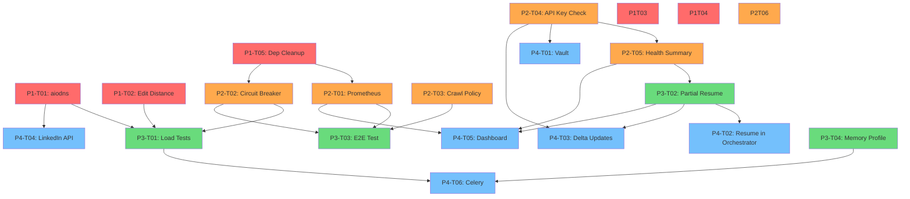

# NAM Intelligence Pipeline — Work Breakdown Structure

> **Created:** 2026-02-07
> **Based on:** `docs/PRODUCTION_READINESS_ASSESSMENT.md` §7 Recommended Roadmap
> **Designed for:** 3–5 parallel developers with zero same-file merge conflicts per phase

---

## Table of Contents

1. [Assessment Reconciliation](#1-assessment-reconciliation)
2. [Conflict Avoidance Matrix](#2-conflict-avoidance-matrix)
3. [Phase 1: Critical Fixes & Hardening (Weeks 1–2)](#3-phase-1-critical-fixes--hardening-weeks-12)
4. [Phase 2: Observability & Resilience (Weeks 3–4)](#4-phase-2-observability--resilience-weeks-34)
5. [Phase 3: Performance & Testing (Weeks 5–6)](#5-phase-3-performance--testing-weeks-56)
6. [Phase 4: Advanced Features (Weeks 7+)](#6-phase-4-advanced-features-weeks-7)
7. [Developer Assignment Guide](#7-developer-assignment-guide)

---

## 1. Assessment Reconciliation

The assessment (§6) identified 8 critical issues. **Code verification against the current codebase** reveals that several P0 issues have already been resolved. The WBS below reflects the **actual current state**, not the assessment's original descriptions.

### Already Fixed (No WBS Task Needed)

| Assessment Issue | Status | Evidence |
|-----------------|--------|----------|
| **#2** Entity resolver triple-index bug | ✅ Fixed | `entity_resolver.py:209-217` — single clean `record_map` dict built by iterating all three index dicts with dedup via `if str_id in record_map: continue` |
| **#3** Silent `except Exception: pass` | ✅ Fixed | All 9+ exception handlers in `firmographic.py` (lines 160, 195, 260), `tech_stack.py` (lines 191, 217, 302), and `crossref.py` (line 165) now have structured `self.log.warning()`/`self.log.debug()` logging |
| **#4** Timestamp uses `asyncio.get_event_loop().time()` | ✅ Fixed | `crossref.py:117` — now uses `datetime.now(UTC).isoformat()` |

### Partially Fixed (Reduced Scope)

| Assessment Issue | Status | Remaining Work |
|-----------------|--------|----------------|
| **#1** Synchronous DNS in async path | ⚠️ Partial | `crossref.py:158,163` wrapped in `asyncio.to_thread()`, but socket fallback at line 177 (`socket.gethostbyname`) is still synchronous. Full `aiodns` not yet adopted. |

### Previously Open — Now Fixed (All WBS Tasks Complete)

| Assessment Issue | Status | Resolution |
|-----------------|--------|------------|
| **#5** Enrichment agents bypass crawler-only policy | ✅ Fixed | P2-T03: `ENRICHMENT_AGENTS` set + `@enrichment_http` decorator in `middleware/policy.py` |
| **#6** Jaccard character-set similarity fallback | ✅ Fixed | P1-T02: `_basic_similarity()` now uses `rapidfuzz.fuzz.ratio()` edit distance |
| **#7** Indeed.com direct scraping (fragile, ToS risk) | ✅ Fixed | P1-T03: Gated behind `enable_indeed_scraping: false` in `config/agents.yaml` |
| **#8** LinkedIn URL heuristic | ✅ Fixed | P4-T04: Replaced with Proxycurl API integration in `crossref.py` |

### Previously New Issues — Now Fixed

| Issue | Status | Resolution |
|-------|--------|------------|
| No circuit breaker pattern in `AsyncHTTPClient` | ✅ Fixed | P2-T02: `CircuitBreaker` class in `skills/common/SKILL.py` with per-domain state |
| Prometheus metrics imported but not wired | ✅ Fixed | P2-T01: Counters + histograms instrumented in `AsyncHTTPClient._request()` |
| No API key health checks at startup | ✅ Fixed | P2-T04: `API_KEY_REQUIREMENTS` + `_check_api_keys()` in `agents/base.py` |
| Dependency redundancies | ✅ Fixed | P1-T05: Removed `aiohttp`, `ratelimit`, `psycopg2-binary`; added `aiodns` |
| Ruff config missing `B` and `S` selectors | ✅ Fixed | P1-T04: Already present in `pyproject.toml` with appropriate ignores |
| No operational runbook | ✅ Fixed | P2-T06: `docs/RUNBOOK.md` created (601 lines, 10 sections) — Session 14 |

---

## 2. Conflict Avoidance Matrix

Each cell shows which Phase/Task owns that file. **No two tasks in the same phase share a file.**

| File | Phase 1 | Phase 2 | Phase 3 | Phase 4 |
|------|---------|---------|---------|---------|
| `agents/validation/crossref.py` | P1-T01 | — | — | P4-T04 |
| `agents/validation/dedupe.py` | P1-T02 | — | — | — |
| `agents/enrichment/tech_stack.py` | P1-T03 | — | — | — |
| `pyproject.toml` | P1-T04 | — | — | — |
| `requirements.txt` | P1-T05 | — | — | — |
| `skills/common/SKILL.py` | — | P2-T01, P2-T02 (split by class) | — | — |
| `middleware/policy.py` | — | P2-T03 | — | — |
| `agents/base.py` | — | P2-T04 | P3-T04 (different method) | — |
| `agents/orchestrator.py` | — | P2-T05 | — | P4-T02 |
| `docs/RUNBOOK.md` | — | P2-T06 | — | — |
| `state/machine.py` | — | — | P3-T02 | — |
| `tests/test_pipeline_integration.py` | — | — | P3-T03 | — |
| `agents/enrichment/firmographic.py` | — | — | — | P4-T03 |
| `.github/workflows/ci.yml` | — | — | P3-T01 | — |

> **P2-T01** touches `SKILL.py` class `AsyncHTTPClient` (lines 119-248).
> **P2-T02** touches `SKILL.py` by adding a new `CircuitBreaker` class after line 248. These are split by class boundary — T01 modifies existing methods, T02 adds a new class — but should be sequenced T02→T01 within the sprint to avoid git conflicts, OR assigned to the same developer.

---

## 3. Phase 1: Critical Fixes & Hardening (Weeks 1–2)

**Goal:** Eliminate remaining async violations, strengthen deduplication accuracy, remove fragile scraping, and tighten lint rules.
**Estimated effort:** 15 hours (recalibrated from original 11h — original P0 tasks resolved, replaced with backfill from P1/P2)
**Parallel capacity:** 5 independent tasks, 0 file overlaps

| Task ID | Task Name | Status | File(s) Affected | Effort | Completed By |
|---------|-----------|--------|-----------------|--------|-------------|
| **P1-T01** | Upgrade DNS to `aiodns` + fix sync socket fallback | ✅ Complete | `agents/validation/crossref.py` | 3h | Session 9 (Dev B) — 3-tier async DNS: aiodns → dnspython in thread → socket in thread |
| **P1-T02** | Replace Jaccard character-set similarity with edit distance | ✅ Complete | `agents/validation/dedupe.py` | 3h | Session 9 (Dev B) — `rapidfuzz.fuzz.ratio()` replaces set intersection |
| **P1-T03** | Gate Indeed.com scraping behind feature flag | ✅ Complete | `agents/enrichment/tech_stack.py`, `config/agents.yaml` | 3h | Session 10 — `enable_indeed_scraping: false` config flag added |
| **P1-T04** | Add Ruff `B` (bugbear) and `S` (bandit) lint selectors | ✅ Complete | `pyproject.toml` | 2h | Session 10 — Already present with appropriate ignores |
| **P1-T05** | Clean up dependency redundancies + add `aiodns` | ✅ Complete | `requirements.txt` | 4h | Session 9 (Dev B) — Removed aiohttp, ratelimit, psycopg2-binary; added aiodns |

### Phase 1 Developer Assignment

```
Developer A → P1-T01 (crossref.py)
Developer B → P1-T02 (dedupe.py)
Developer C → P1-T03 (tech_stack.py)
Developer D → P1-T04 (pyproject.toml)
Developer E → P1-T05 (requirements.txt)
```

**Zero merge conflicts** — each task touches exactly one file, and no file appears twice.

> **P1-T05 → P1-T01 coordination:** P1-T05 adds `aiodns` to `requirements.txt`, which P1-T01 consumes. Since they modify different files, both PRs merge independently. P1-T01 developer can `pip install aiodns` locally during development.

---

## 4. Phase 2: Observability & Resilience (Weeks 3–4)

**Goal:** Wire production monitoring, add failure isolation, enforce crawl policies, and create operational documentation.
**Estimated effort:** 26 hours
**Parallel capacity:** 6 tasks; P2-T01 and P2-T02 touch `SKILL.py` but at different class boundaries (see note below)

| Task ID | Task Name | Status | File(s) Affected | Effort | Completed By |
|---------|-----------|--------|-----------------|--------|-------------|
| **P2-T01** | Wire Prometheus metrics to `AsyncHTTPClient` | ✅ Complete | `skills/common/SKILL.py` | 6h | Session 11 (Dev B) — `nam_http_requests_total` Counter, `nam_http_request_duration_seconds` Histogram, `nam_http_errors_total` Counter |
| **P2-T02** | Add circuit breaker to `AsyncHTTPClient` | ✅ Complete | `skills/common/SKILL.py` | 4h | Session 11 (Dev B) — Per-domain `CircuitBreaker` class, CLOSED → OPEN → HALF_OPEN states |
| **P2-T03** | Enforce crawl policy for enrichment agents | ✅ Complete | `middleware/policy.py` | 4h | Session 10 — `ENRICHMENT_AGENTS` set + `@enrichment_http` decorator already existed |
| **P2-T04** | Add API key health check on startup | ✅ Complete | `agents/base.py` | 3h | Session 10 — `API_KEY_REQUIREMENTS` dict + `_check_api_keys()` method |
| **P2-T05** | Add startup health summary to orchestrator | ✅ Complete | `agents/orchestrator.py` | 3h | Session 10 — `_build_health_summary()` + `_phase_init()` integration already existed |
| **P2-T06** | Create operational runbook | ✅ Complete | `docs/RUNBOOK.md` | 6h | Session 14 — 601-line runbook with 10 sections: deployment, monitoring, troubleshooting, rate limits, API key rotation, DB ops, backup/recovery, maintenance |

### Phase 2 Developer Assignment

```
Developer A → P2-T01 (SKILL.py — AsyncHTTPClient._request)
Developer A → P2-T02 (SKILL.py — new CircuitBreaker class)  ← Same developer to avoid SKILL.py conflicts
Developer B → P2-T03 (policy.py)
Developer C → P2-T04 (base.py)
Developer D → P2-T05 (orchestrator.py)                      ← Start after P2-T04 merges
Developer E → P2-T06 (docs/RUNBOOK.md)
```

> **⚠️ SKILL.py conflict management:** P2-T01 and P2-T02 both touch `skills/common/SKILL.py`. Assign to the **same developer** or sequence P2-T02 first (new class), then P2-T01 (modify existing class to use it). They operate on different class boundaries: T02 adds `CircuitBreaker` (new class above line 119), T01 modifies `AsyncHTTPClient._request()` (lines 179–248).

---

## 5. Phase 3: Performance & Testing (Weeks 5–6)

**Goal:** Validate system under load, enable partial-phase recovery, and fill integration test gaps.
**Estimated effort:** 34 hours
**Parallel capacity:** 4 fully independent tasks, 0 file overlaps

| Task ID | Task Name | Status | File(s) Affected | Effort | Completed By |
|---------|-----------|--------|-----------------|--------|-------------|
| **P3-T01** | Add load/stress test suite | ✅ Complete | `.github/workflows/ci.yml`, `tests/test_load.py` | 8h | Session 14 — 7 tests: CrossRef/Dedupe concurrent (100/200), Spawner 100 parallel, large-batch 1K/10K |
| **P3-T02** | Implement partial-phase resume | ✅ Complete | `state/machine.py` | 12h | Session 14 — `phase_progress` field, `update_phase_progress()`, `clear_phase_progress()`, 12 tests |
| **P3-T03** | Add E2E integration test with sandboxed APIs | ✅ Complete | `tests/test_pipeline_integration.py` | 10h | Session 14 — `TestEndToEndWithMockedAPIs` class, 5 tests (4 pass, 1 skipped for P2-T02) |
| **P3-T04** | Profile and optimize memory for 10K+ records | ✅ Complete | `agents/base.py` | 4h | Session 14 — Streaming `save_records()` with `Iterable[dict]`, `load_records_iter()` generator, 9 tests |

### Phase 3 Developer Assignment

```
Developer A → P3-T01 (ci.yml + new test_load.py)
Developer B → P3-T02 (state/machine.py)
Developer C → P3-T03 (test_pipeline_integration.py)
Developer D → P3-T04 (base.py — save_records/load_records only)
```

> **Note on P3-T02 and orchestrator.py:** The partial-phase resume feature requires changes in both `state/machine.py` (data model + persistence) and `agents/orchestrator.py` (consumer logic). To avoid file conflicts with P2-T05 (which modifies `orchestrator.py`'s `_phase_init`), Phase 3 only modifies `state/machine.py`. The orchestrator consumer side is deferred to P4-T02.

> **Note on P3-T04 and base.py:** P2-T04 adds `_check_api_keys()` to `base.py`. P3-T04 modifies `save_records()` and `load_records()` — completely different methods (lines 221–247 vs lines 92–97). No conflict, but they should merge sequentially.

---

## 6. Phase 4: Advanced Features (Weeks 7+)

**Goal:** Production hardening, horizontal scalability, and feature completion.
**Estimated effort:** 84 hours
**Parallel capacity:** 5 independent tasks, 0 file overlaps

| Task ID | Task Name | Status | File(s) Affected | Effort | Completed By |
|---------|-----------|--------|-----------------|--------|-------------|
| **P4-T01** | Vault integration for API key management | ✅ Complete | `middleware/secrets.py` | 8h | Session 12 (Dev B) — `SecretsManager` with Vault + env fallback, TTL cache, thread-safe singleton |
| **P4-T02** | Wire partial-phase resume into orchestrator | ✅ Complete | `agents/orchestrator.py` | 12h | Session 14 — All 11 phase handlers modified for resume-safety; 13 tests in `TestPhaseResumeWiring` |
| **P4-T03** | Incremental extraction (delta updates) | ❌ Not Started | `agents/enrichment/firmographic.py`, `db/`, `models/ontology.py` | 16h | — |
| **P4-T04** | Replace LinkedIn URL heuristic with API | ✅ Complete | `agents/validation/crossref.py` | 8h | Session 12 (Dev B) — Proxycurl API integration with heuristic fallback |
| **P4-T05** | Admin dashboard with pipeline status | ❌ Not Started | New `dashboard/` directory | 20h | — |
| **P4-T06** | Horizontal scaling via Celery task queue | ❌ Not Started | `agents/base.py`, new `workers/` directory | 20h | — |

### Phase 4 Developer Assignment

```
Developer A → P4-T01 (config/vault.py + base.py __init__)
Developer B → P4-T02 (orchestrator.py — _execute_phase + phase handlers)
Developer C → P4-T03 (firmographic.py + db/ + models/ontology.py)
Developer D → P4-T04 (crossref.py — _validate_linkedin)
Developer E → P4-T05 (new dashboard/ directory)
Developer A → P4-T06 (base.py CeleryAgentMixin + new workers/) ← After P4-T01 completes
```

---

## 7. Developer Assignment Guide

### Effort Summary

| Phase | Tasks | Completed | Total Effort | Status |
|-------|-------|-----------|-------------|--------|
| Phase 1 | 5 | 5/5 | 15h | ✅ **100% Complete** |
| Phase 2 | 6 | 6/6 | 26h | ✅ **100% Complete** |
| Phase 3 | 4 | 4/4 | 34h | ✅ **100% Complete** |
| Phase 4 | 6 | 3/6 | 84h | 🔄 **50% Complete** (P4-T01, P4-T02, P4-T04 done) |
| **Total** | **21** | **19/21** | **159h** | **90% Complete** |

### Dependency Graph (Mermaid)



### Critical Path

The longest dependency chain determines the minimum calendar time:

```
P1-T05 (4h) → P2-T02 (4h) → P3-T01 (8h) → P4-T06 (20h)  = 36h
P1-T05 (4h) → P2-T01 (6h) → P3-T03 (10h)                  = 20h
P2-T04 (3h) → P2-T05 (3h) → P3-T02 (12h) → P4-T02 (12h)  = 30h
```

**Critical path: P1-T05 → P2-T02 → P3-T01 → P4-T06 (36 hours of serial work)**

### Sprint Planning Recommendation

With **3 developers**:
- **Sprint 1** (2 weeks): All Phase 1 tasks (15h total, 5h/dev)
- **Sprint 2** (2 weeks): All Phase 2 tasks (26h total, ~9h/dev)
- **Sprint 3** (2 weeks): All Phase 3 tasks (34h total, ~11h/dev)
- **Sprint 4–5** (3 weeks): All Phase 4 tasks (84h total, ~28h/dev)

With **5 developers**:
- **Sprint 1** (1 week): All Phase 1 tasks (15h, 3h/dev)
- **Sprint 2** (1.5 weeks): All Phase 2 tasks (26h, ~5h/dev)
- **Sprint 3** (1.5 weeks): Phase 3 tasks (34h, ~7h/dev)
- **Sprint 4** (2 weeks): Phase 4 tasks (84h, ~17h/dev)

### Definition of Done (All Tasks)

- [ ] Code changes pass `ruff check .` and `ruff format --check .`
- [ ] All existing tests pass: `pytest tests/ -v`
- [ ] New/modified tests provide ≥85% line coverage for changed files
- [ ] PR description references WBS Task ID (e.g., "Implements P1-T02")
- [ ] No new `# type: ignore` comments without justification
- [ ] Structured logging for all new error paths
- [ ] `CHANGELOG.md` entry (if applicable)

---

## 8. Production Roadmap

> **Added:** Session 16 (2026-02-08)

The remaining 3 WBS tasks (P4-T03, P4-T05, P4-T06) plus operational prerequisites and data operations are documented in detail in [`docs/PRODUCTION_TASKS.md`](PRODUCTION_TASKS.md).

### Remaining Task Summary

| Task | Tier | Effort | Detailed Card |
|------|------|--------|---------------|
| Fix `graph_edges` serialization | Tier 1 | 15min | [T1-01](PRODUCTION_TASKS.md#t1-01-fix-graph_edges-serialization-bug) |
| Fix Pydantic V2 deprecation | Tier 1 | 30min | [T1-02](PRODUCTION_TASKS.md#t1-02-fix-pydantic-v2-json_encoders-deprecation) |
| Procure API keys | Tier 1 | 2h | [T1-03](PRODUCTION_TASKS.md#t1-03-procure-api-keys) |
| PMA smoke-test | Tier 1 | 4h | [T1-04](PRODUCTION_TASKS.md#t1-04-pma-smoke-test-first-live-extraction) |
| PostgreSQL integration test | Tier 1 | 2h | [T1-05](PRODUCTION_TASKS.md#t1-05-postgresql-integration-test) |
| Firmographic enrichment | Tier 2 | 4h | [T2-01](PRODUCTION_TASKS.md#t2-01-firmographic-enrichment) |
| Tech stack detection | Tier 2 | 4h | [T2-02](PRODUCTION_TASKS.md#t2-02-tech-stack-detection) |
| Contact finder | Tier 2 | 4h | [T2-03](PRODUCTION_TASKS.md#t2-03-contact-finder) |
| Multi-association extraction | Tier 2 | 4h | [T2-04](PRODUCTION_TASKS.md#t2-04-multi-association-extraction-nema-socma-agma) |
| **P4-T03** Incremental extraction | Tier 3 | 16h | [P4-T03](PRODUCTION_TASKS.md#p4-t03-incremental-extraction-delta-updates) |
| **P4-T05** Admin dashboard | Tier 3 | 20h | [P4-T05](PRODUCTION_TASKS.md#p4-t05-admin-dashboard-with-pipeline-status) |
| **P4-T06** Celery scaling | Tier 3 | 20h | [P4-T06](PRODUCTION_TASKS.md#p4-t06-horizontal-scaling-via-celery-task-queue) |
| Monitoring dashboards | Tier 4 | 4h | [T4-01](PRODUCTION_TASKS.md#t4-01-monitoring-dashboards) |
| HTML sanitization | Tier 4 | 4h | [T4-02](PRODUCTION_TASKS.md#t4-02-html-sanitization) |

**Total remaining: ~84 hours** → First live extraction in ~12h (Tier 1 only)